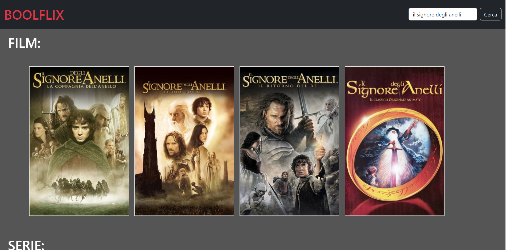
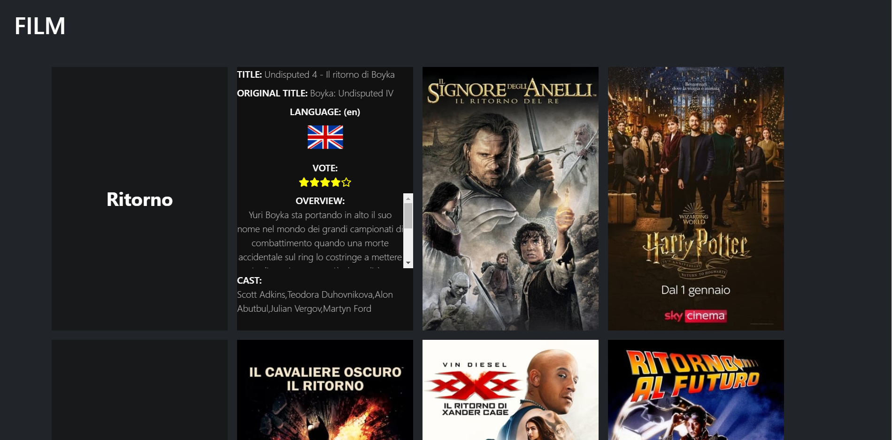

<!-- # Vue 3 + Vite

This template should help get you started developing with Vue 3 in Vite. The template uses Vue 3 `<script setup>` SFCs, check out the [script setup docs](https://v3.vuejs.org/api/sfc-script-setup.html#sfc-script-setup) to learn more.

## Recommended IDE Setup

- [VS Code](https://code.visualstudio.com/) + [Volar](https://marketplace.visualstudio.com/items?itemName=Vue.volar) (and disable Vetur) + [TypeScript Vue Plugin (Volar)](https://marketplace.visualstudio.com/items?itemName=Vue.vscode-typescript-vue-plugin). -->

# BOOLFLIX

> Replica sito Netflix

## TECNOLOGIE E LIBRERIE:

- Html
- Css / Scss
- Bootstrap
- Vue 3
- Vite
- Axios (API The Movie DB)

## Milestone 1:

Creare un layout base con una searchbar (una input e un button) in cui possiamo scrivere completamente o parzialmente il nome di un film. Possiamo, cliccando il bottone, cercare sull’API tutti i film che contengono ciò che ha scritto l’utente.
Vogliamo dopo la risposta dell’API visualizzare a schermo i seguenti valori per ogni film trovato:

1. Titolo
2. Titolo Originale
3. Lingua
4. Voto

## Milestone 2:

- Trasformiamo la stringa statica della lingua in una vera e propria bandiera della nazione corrispondente, gestendo il caso in cui non abbiamo la bandiera della nazione ritornata dall’API.
- Allarghiamo poi la ricerca anche alle serie tv. Con la stessa azione di ricerca dovremo prendere sia i film che corrispondono alla query, sia le serie tv.

## Milestone 3:

- Aggiungiamo la copertina del film o della serie all'elenco.
- Trasformiamo poi il voto da 1 a 10 decimale in un numero intero da 1 a 5, per poi stampare a schermo un numero di stelle piene che vanno da 1 a 5, lasciando le restanti vuote(senza gestire mezze icone, ma arrotondando sempre per eccesso all'unità successiva).

## Milestone 4:

Trasformo quello fatto fino ad ora in una vera e propria webapp, creando un layout completo simil-Netflix:

- Un header che contiene logo e search bar
- Dopo aver ricercato qualcosa nella searchbar, i risultati appaiono sotto forma di “card” in cui lo sfondo è rappresentato dall’immagine di copertina
- Andando con il mouse sopra una card (on hover), avviene effetto flip 3D della card e sul retro appaiono le informazioni aggiuntive già prese nei punti precedenti più la overview

## Milestone 5 (opzionale):

Partendo da un film o da una serie, richiedere all'API quali sono gli attori che fanno parte del cast aggiungendo alla nostra scheda Film / Serie SOLO i primi 5 restituiti
dall’API con Nome e Cognome.

;
